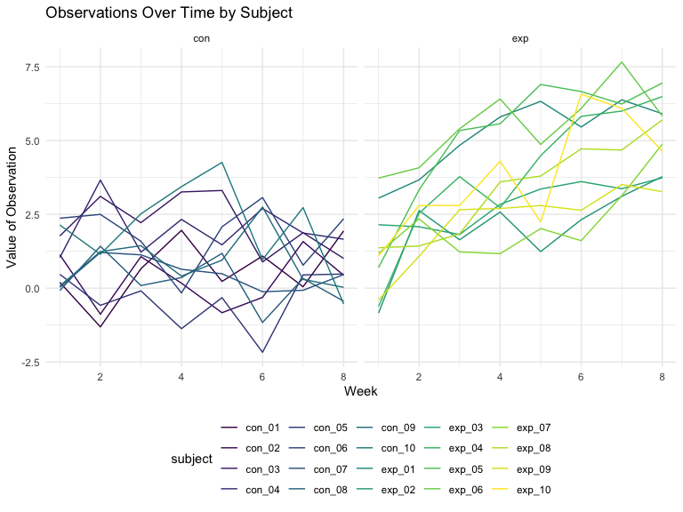

p8105_hw5_jl6647
================
Jiatong Li
2023-11-02

``` r
library(tidyverse)
```

    ## ── Attaching core tidyverse packages ──────────────────────── tidyverse 2.0.0 ──
    ## ✔ dplyr     1.1.3     ✔ readr     2.1.4
    ## ✔ forcats   1.0.0     ✔ stringr   1.5.0
    ## ✔ ggplot2   3.4.3     ✔ tibble    3.2.1
    ## ✔ lubridate 1.9.2     ✔ tidyr     1.3.0
    ## ✔ purrr     1.0.2     
    ## ── Conflicts ────────────────────────────────────────── tidyverse_conflicts() ──
    ## ✖ dplyr::filter() masks stats::filter()
    ## ✖ dplyr::lag()    masks stats::lag()
    ## ℹ Use the conflicted package (<http://conflicted.r-lib.org/>) to force all conflicts to become errors

``` r
library(rvest)
```

    ## 
    ## Attaching package: 'rvest'
    ## 
    ## The following object is masked from 'package:readr':
    ## 
    ##     guess_encoding

``` r
library(viridis)
```

    ## Loading required package: viridisLite

``` r
library(readr)
library(plotly)
```

    ## 
    ## Attaching package: 'plotly'
    ## 
    ## The following object is masked from 'package:ggplot2':
    ## 
    ##     last_plot
    ## 
    ## The following object is masked from 'package:stats':
    ## 
    ##     filter
    ## 
    ## The following object is masked from 'package:graphics':
    ## 
    ##     layout

``` r
library(broom)
library(purrr)

knitr::opts_chunk$set(
    echo = TRUE,
    warning = FALSE,
    fig.width = 8, 
  fig.height = 6,
  out.width = "90%"
)

options(
  ggplot2.continuous.colour = "viridis",
  ggplot2.continuous.fill = "viridis"
)

scale_colour_discrete = scale_colour_viridis_d
scale_fill_discrete = scale_fill_viridis_d

theme_set(theme_minimal() + theme(legend.position = "bottom"))
```

## Problem 1

## Problem 2

Create a tidy dataframe containing data from all participants, including
the subject ID, arm, and observations over time

``` r
all_data =
 tibble(filename = list.files("./data/"))
readcsv = 
  function(csv, path="./data/"){
 paste(path,csv,sep="/") |> 
   read.csv()
  }
data_df =
  all_data |> 
  mutate(raw_results = map(all_data$filename, readcsv)) |> 
  # unnest for easier plot
  unnest(raw_results) |> 
  # remove .csv part
  mutate(filename_wo_csv = map_chr(.x = filename, ~ unlist(str_split(.x, "\\.") )[[1]] ) ) |> 
  # split by '_' to extract arm and subject id
  mutate(
    arm = map_chr(.x = filename_wo_csv, ~ unlist(str_split(.x, "_") )[[1]] )) |> 
  mutate(
    subject_id = map_chr(.x = filename_wo_csv, ~ unlist(str_split(.x, "_") )[[2]] ))
```

Make a spaghetti plot showing observations on each subject over time,
and comment on differences between groups

``` r
pivot_longer =
  data_df |> 
  pivot_longer(week_1:week_8,
               names_to = "week",
               names_prefix = "week_",
               values_to = "value") |> 
  mutate(week = as.integer(week))
plot =
  pivot_longer |> 
  group_by(filename_wo_csv) |> 
  ggplot(aes(x = week, y = value, color = interaction(arm, subject_id))) +
    geom_line()
plot
```


From this plot, we can find that the observation for all patients in
experimental arm are increasing over eight weeks,but there appears to be
a noticeable difference between the experimental and control groups,
with the experimental group showing a more positive trend over time
compared to the control group. The observation for all patients in
experimental arm are increasing over eight weeks.

## Problem 3

We first test the efficacy of the function on $\mu=0$.

``` r
sim_mean_pvalue = function(mu, n = 30, sigma = 5) {
  sim_data = tibble(
    x = rnorm(n = 30, mean = mu, sd = sigma),
  )
  
  sim_data |>  
    t.test() |>  
    broom::tidy() |>  
    select(mu_hat = estimate, 
           p_value = p.value)
  
}

# To replicate 5000 times
sim_results_df = 
  expand_grid(
    true_mean = 0,
    iter = 1:5000
  ) |> 
  mutate(
    estimate_df = map(true_mean, sim_mean_pvalue)
  ) |> 
  unnest(estimate_df)
```

Repeat the process for μ=1,2,3,4,5,6 (also replicate 5000 times)

``` r
sim_results_df = 
  expand_grid(
    true_mean = c(0, 1, 2, 3, 4, 5, 6),
    iter = 1:5000
  ) |> 
  mutate(
    estimate_df = map(true_mean, sim_mean_pvalue)
  ) |> 
  unnest(estimate_df) |> 
  select(-iter)
```

##### Make a plot showing the proportion of times the null was rejected (the power of the test) on the y axis and the true value of μ on the x axis. Describe the association between effect size and power. Make a plot showing the average estimate of μ on the y axis and the true value of μ on the x axis.

``` r
sim_results_df |> 
  filter(p_value < 0.05) |> 
  group_by(true_mean) |> 
  summarise(power = n()/5000) |> 
  ggplot(aes(x = true_mean, y = power)) +
  geom_line() +
  geom_point() +
  geom_smooth() +
  theme_minimal() +
  labs(title = "Power vs. True value of μ", x = "True value of μ", y = "The power of the test")
```

    ## `geom_smooth()` using method = 'loess' and formula = 'y ~ x'


From the plot we can see that the power of the test increases as the
effect size increases from 0 to 6

``` r
sim_results_df |>  
  group_by(true_mean) |> 
  summarise(est_mean = mean(mu_hat)) |> 
  ggplot(aes(x = true_mean, y = est_mean)) +
  geom_line() +
  geom_point() +
  geom_smooth() +
  labs(title = "The average estimate value of μ vs. True value of μ", x = "True value of μ", y = "The average estimate value of μ")
```

    ## `geom_smooth()` using method = 'loess' and formula = 'y ~ x'


From this plot we can find that the relationship between the average
estimate value of μ and the true value of μ is positive correlation

##### Make a second plot (or overlay on the first) the average estimate of μ̂ only in samples for which the null was rejected on the y axis and the true value of μ on the x axis. Is the sample average of μ̂ across tests for which the null is rejected approximately equal to the true value of μ? Why or why not?

``` r
sim_results_df |> 
  filter(p_value < 0.05) |> 
  group_by(true_mean) |> 
  summarise(est_mean = mean(mu_hat)) |> 
  ggplot(aes(x = true_mean, y = est_mean)) +
  geom_line() +
  geom_point() +
  geom_smooth() +
  theme_minimal() +
  labs(title = "The average estimate value of μ (p_value < 0.05) vs. True value of μ", x = "True value of μ", y = "The average estimate value of μ")
```

    ## `geom_smooth()` using method = 'loess' and formula = 'y ~ x'



From the plot, we can find that the sample average of μ̂ across tests for
which the null is rejected (p_value \< 0.05) is not approximately equal
to the true value of μ. So the null will be rejected under the
confidence interval.
